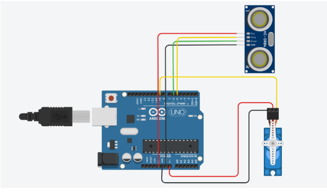

AUTOMATIC DUSTBIN OPENER USING ARDUINO
PROJECT REPORT

INTRODUCTION:

Maintaining hygiene is an important aspect of modern life, especially in public places such as hospitals, schools, offices, and homes. Touching dustbin lids with hands can spread germs and cause health problems. To overcome this issue, an automatic dustbin opener provides a contactless and hygienic solution.

This project presents the design and implementation of an Automatic Dustbin Opener using Arduino. The system automatically opens the dustbin lid when a person brings their hand near it. The project uses an ultrasonic sensor to detect hand movement and a servo motor to open and close the lid.

This project demonstrates the practical application of embedded systems, sensors, and microcontrollers to solve real-world problems in a simple and cost-effective way.

OBJECTIVE:

To design a touchless dustbin system

To improve hygiene and reduce the spread of germs

To understand Arduino-based sensor and motor control

To automate the opening and closing of a dustbin lid
## Circuit Diagram

COMPONENTS USED:

Arduino UNO

Ultrasonic Sensor (HC-SR04)

Servo Motor (SG90)

Breadboard

Jumper Wires

Power Supply (USB / 9V Battery)

Dustbin

ULTRASONIC SENSOR (HC-SR04):

The ultrasonic sensor is used to detect the presence of a hand near the dustbin. It works by sending ultrasonic sound waves and receiving the reflected echo. The distance is calculated based on the time taken by the sound waves to return.

Distance = (Time × Speed of Sound) / 2

ARDUINO UNO:

Arduino UNO is the main controller of the system. It receives distance data from the ultrasonic sensor and processes it. Based on the distance, Arduino sends control signals to the servo motor to open or close the dustbin lid.

SERVO MOTOR:

The servo motor is used to control the opening and closing of the dustbin lid. It rotates to a specific angle when instructed by Arduino.

0 degrees: Lid Closed

90 degrees: Lid Open

Servo motors are preferred because they provide accurate angle control and consume less power.

WORKING PRINCIPLE:

The ultrasonic sensor continuously measures the distance in front of the dustbin.

When a hand comes close to the sensor (within 10–15 cm), the sensor detects it.

The Arduino processes the distance value.

If the distance is less than the preset limit, Arduino sends a signal to the servo motor.

The servo motor opens the dustbin lid.

After a short delay, the lid automatically closes.

CIRCUIT CONNECTIONS:

Ultrasonic Sensor Connections:

VCC → 5V

GND → GND

TRIG → Digital Pin 9

ECHO → Digital Pin 10

Servo Motor Connections:

Red wire → 5V

Brown/Black wire → GND

Yellow wire → Digital Pin 6

ARDUINO CODE:

#include <Servo.h>

Servo dustbinServo;

int trigPin = 9;
int echoPin = 10;
long duration;
int distance;

void setup() {
  dustbinServo.attach(6);
  pinMode(trigPin, OUTPUT);
  pinMode(echoPin, INPUT);
  dustbinServo.write(0);
}

void loop() {
  digitalWrite(trigPin, LOW);
  delayMicroseconds(2);

  digitalWrite(trigPin, HIGH);
  delayMicroseconds(10);
  digitalWrite(trigPin, LOW);

  duration = pulseIn(echoPin, HIGH);
  distance = duration * 0.034 / 2;

  if (distance > 0 && distance < 15) {
    dustbinServo.write(90);
    delay(2000);
    dustbinServo.write(0);
  }
}

RESULTS:

The automatic dustbin opener was successfully designed and tested. The dustbin lid opened automatically when a hand was placed near the sensor and closed after a few seconds.

Observed behavior:

Accurate hand detection

Smooth servo motor operation

Reliable opening and closing of lid

Low power consumption

CONCLUSION:

The Automatic Dustbin Opener using Arduino was successfully implemented. The system effectively detects hand movement and opens the dustbin lid automatically, providing a hygienic and user-friendly solution. This project demonstrates the effective use of Arduino, ultrasonic sensors, and servo motors in automation.

The project is suitable for homes, offices, hospitals, and public places.

ADVANTAGES:

Touchless and hygienic operation

Simple and low-cost design

Easy to construct and modify

Low power consumption

User-friendly

LIMITATIONS:

Limited detection range

Requires stable power supply

Not suitable for outdoor use without protection

Mechanical wear over long-term use

FUTURE SCOPE:

Integration with IoT for monitoring

Solar-powered operation

Waste level indication

Voice or sound alerts

Improved sensor accuracy

REFERENCES:

Arduino Official Documentation

HC-SR04 Ultrasonic Sensor Datasheet

Servo Motor Datasheet

Electronics Tutorials

Embedded Systems Books# automatic-dustbin-opener
